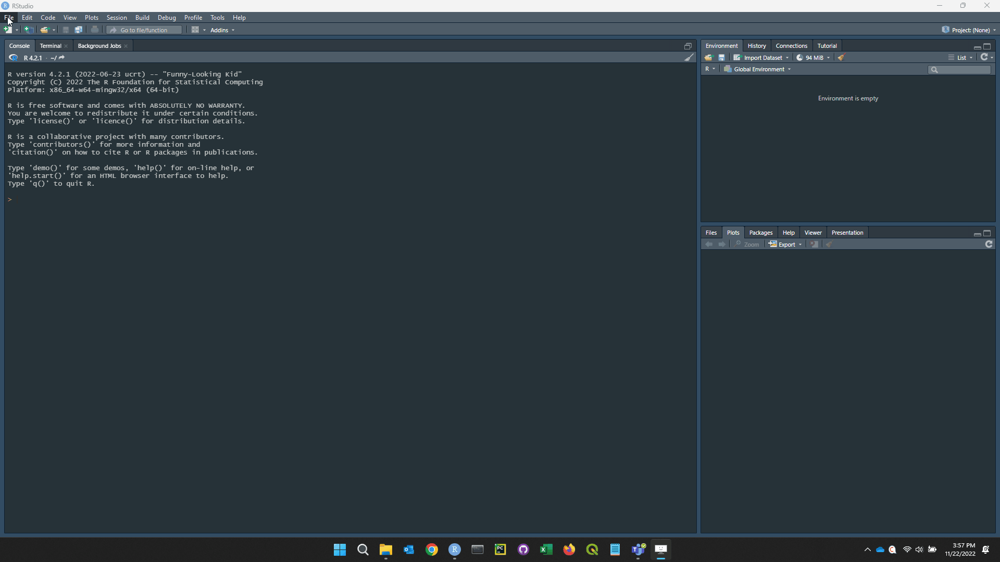

# Stream Intermittency Visualization Dashboard (SIVD)

## Project Description
The SIVD tool provides the ability to analyze high frequency Stream, Temperature, Intermittency and Conductivity (STIC; [Chapin et al. 2014](https://doi.org/10.1002/2013WR015158)) logger data, field observations and associated datasets in an environment that promotes interactivity and data exploration. This dashboards facilitated data processing related to stream data collection efforts at 180 perennial and non-perennial sites across the Great Plains and Upper Midwest of the United States.  The dashboard served multiple purposes as part of data processing and analysis workflow, 1) to visualize multiple data streams of high frequency sensor data, 2) to have at-a-glance hydrologic metrics created during and after data processing, and 3) to view data quality metrics we created to describe high-frequency dataset quality (e.g. length, completeness). We provide an example dataset and the R code used to create the Shiny dashboard. We also created a video that shows an example of how the dashboard was used to visualize data and infer wet and dry periods in a stream reach.
## Usage
### Code
Code in this repository can be used to generate the Shiny dashboard.  There are two R files used to create the SIVD.
* SIVD_main.R
	* Contains the UI, server, and ShinyApp call that create the dashboard
* HTML_tables.R
	* Contains the code to generate the HTML tables in the dashboard
	
Alternatively, if you do not wish to set up the application on your own, the SIVD example app can be accessed on the web [here](https://ecosystemplanningrestoration.shinyapps.io/SIVD_hp/).  

### Data
There are four CSV files containing the data used by the application.
* GP_P1-3_logger_daily_2022-03-16.csv
* GP_P1-3_logger_hourly_2022-03-16.csv
* GP_P1-3_summary_2022-03-16.csv
* S123_field_data_2022-03-15.csv

### Getting Started
The steps below outline the process of setting up the example dashboard on a Windows computer.
* Background Steps: If R and RStudio are not installed on the computer, please follow these steps:
	* [Download R](https://www.r-project.org/) and install.
	* [Download RStudio](https://posit.co/) and install. R should be installed before RStudio.
* Step 1: [Click here](https://github.com/USEPA/stream-intermittency-visualization-dashboard/archive/refs/heads/main.zip) to download the code files and the data files listed in the Code section and Data section.
* Step 2: Extract the downloaded file into a new project folder on your local machine. The folder should have the same structure as provided below.

``` bash
├─ SIVD_project_folder
│  ├─ SIVD_main.R
│  ├─ HTML_tables.R
│  └─ Data
│     ├─ GP_P1-3_logger_daily_2022-03-16.csv
│     ├─ GP_P1-3_logger_hourly_2022-03-16.csv
│     ├─ GP_P1-3_summary_2022-03-16.csv
│     └─ S123_field_data_2022-03-15.csv
```
* Step 3: Open RStudio -> File -> New Project... -> Existing Directory -> Navigate to your project folder from Step 2 and select the actual folder as your directory.
* Step 4: File -> Open File... -> SIVD_main.R
* Step 5: Click the "Run App" button at top, right-hand side of the code window to run the Shiny app.  A new window will open up with the app hosted locally.  If this is the first time running the app, you may be prompted to install the libraries utilized by the app.  This could take several minutes to complete.



### Dashboard Description
1)	The Stream Intermittency Visualization dashboard runs off four tabs. Visualization Splash Board tab. This is the main visualization page for viewing multiple forms of data for a single site. To get started select one or more state(s) from the drop-down state menu. Using your mouse, you can adjust or keyboard to directly enter the minimum days to filter sites having a minimum number of days on record. Select a site from drop-down site code menu and the plots and data summaries for the selected site code will appear on the visualization splash board. The splash board includes high frequency logger and precipitation data, a pie chart of data record completeness for the logger data, aerial imagery of the site, and three tables that summarize logger data (Site Summary Metrics), data quality and field observations. For sites have duplicate data loggers the user can view plots from each logger separately (L1 or L2) or data from both loggers simultaneously (L1 & L2). With the daily mean intensity data the user can select overlaying daily total precipitation or daily mean temperature or select viewing hourly logger intensity and temperature data. Various tools are available for the user to capture image, zoom, pan, and identify specific values on plots.

2)	Daily Logger Data tab. This tab summarized the high frequency logger observations collected every hour into daily summary metrics. The column flow.binary.day presents the conversion of hourly intensity data to a binary determination of flow or no flow for a logger. The mean daily intensity was calculated from the hourly intensity for each day.  If the mean daily intensity was greater than the calibrated intensity value for the logger, the stream was considered flowing and flow.binary day is equal to 1.  This and other columns in the Daily Logger Data tab run the high frequency data and record completeness data visualizations on the dash board tab.

3)	Data Quality Rankings tab. This tab summarizes data from the Daily Logger Data tab for each logger and includes data presented in the Site Summary Metrics table and the Data Quality Rankings table. It calculates the total number of days expected for the period of record (recLength) based on the day the logger were deployed and retrieved and calculates the number of days intensity was recorded for each logger (total.rec.values). This tab also includes the total number of consecutive flow days (myear) and dry days (dyear) for the period of record of a logger    . Recency, length, and completeness confidence  columns present rankings based on criteria our research group decided would best describe logger datasets when compared to other high frequency datasets we used in our study (e.g. United State Geological Survey gage datasets). 

4)	Field Observations Data tab. This tab presents observational hydrologic data at each site visit. All sites within the Great Plains example dataset were visited up to four times, except for a few local sites that were visited five or six times  . Data in this tab are presented in the Field Observations table and include hydrologic observations describe the hydrologic condition (flow, no flow, isolated pools, interstitial flow) at the logger. It includes the max depth of water observed at a site and the percent of surface flow and sub surface flow observed within the study reach (hi_reachlengthsurface, hi_reachlengthsub, respectively). It also includes the Channel Score which is a relative index that describes the extent of surface flow in the reach with zero representing no surface flow and six representing continuous surface flow. The length of study reaches in the example dataset were 40X bankfull channel-widths or a maximum of 200 m. Visits corresponding with vertical black lines on plots in the visualization splash board can be individually selected by users to show associated field observation data.


## Software
The dashboard was developed with R software, version 4.1.0, on a Windows computer.  The code may need to be adapted to run on other operating systems. Please see SIVD_dependencies.csv for a list of all of the libraries used by the app and their dependencies.  

## References
* [Chapin, T.P., Todd, A.S. and Zeigler, M.P., 2014. Robust, low‐cost data loggers for stream temperature, flow intermittency, and relative conductivity monitoring. Water Resources Research, 50(8), pp.6542-6548.](https://doi.org/10.1002/2013WR015158)
* [Shiny from RStudio](https://shiny.rstudio.com/)


# Disclaimer
The United States Environmental Protection Agency (EPA) GitHub project code is provided on an “as is” basis and the user assumes responsibility for its use. EPA has relinquished control of the information and no longer has responsibility to protect the integrity, confidentiality, or availability of the information. Any reference to specific commercial products, processes, or services by service mark, trademark, manufacturer, or otherwise, does not constitute or imply their endorsement, recommendation or favoring by EPA. The EPA seal and logo shall not be used in any manner to imply endorsement of any commercial product or activity by EPA or the United States Government.

